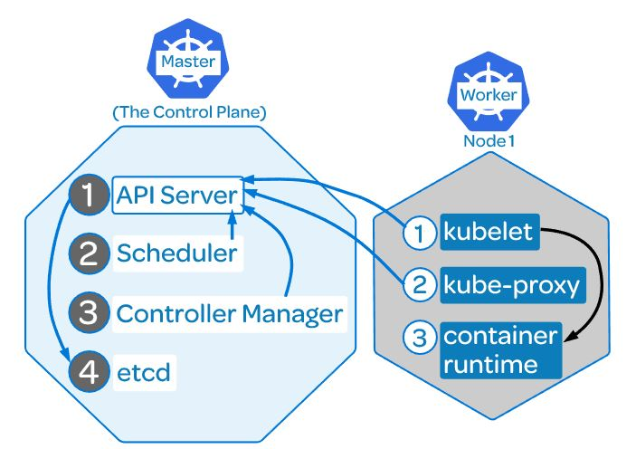
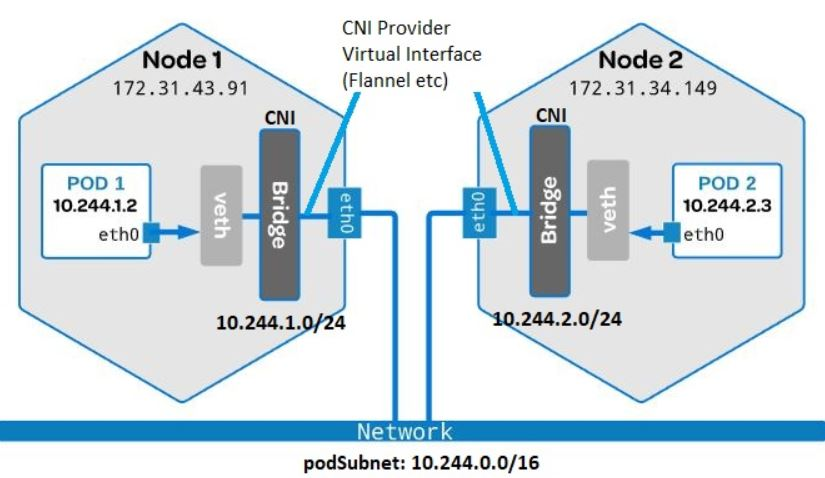
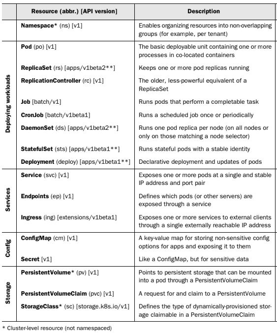
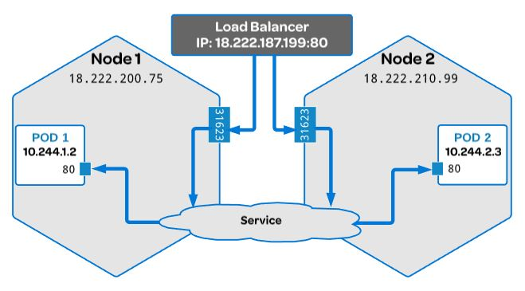
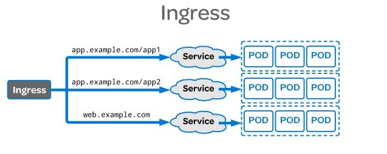

# k8-playground



**_Control Plane_** manages the worker nodes and the Pods in the cluster\
**kube-apiserver:** Communication hub for all cluster components, exposes the kubernetes API.\
**kube-scheduler:** Assign apps to worker node, Auto-detects which pod should be assigned to which node based on resource requirements.\
**kube-controller-manager:** Maintains the cluster. Handels node failure, replication components, maintain correct number of pods etc.\
**etcd:** Datastore that stores the cluster configuration.

**_Worker_**\
**kubelet:** An agent that runs on each node in the cluster. Runs and manages the containers on the nodes and talks to the API server.\
**kube-proxy:** Load balances traffic b/w the app components, keeps track of endpoints and updates IP tables for routing traffic appropriately.\
**Container Runtime:** Kubernetes supports several container runtimes: Docker, containerd, CRI-O, and any implementation of the Kubernetes CRI (Container Runtime Interface).

Using
**Vagrant box <http://cloud-images.ubuntu.com/bionic/current/bionic-server-cloudimg-amd64-vagrant.box>**

### Setup All Nodes [Master/Worker]
```        
curl -s https://packages.cloud.google.com/apt/doc/apt-key.gpg | sudo apt-key add -
echo "deb https://apt.kubernetes.io/ kubernetes-xenial main" | sudo tee -a /etc/apt/sources.list.d/kubernetes.list
apt-get install -y apt-transport-https ca-certificates curl gnupg-agent software-properties-common
curl -fsSL https://download.docker.com/linux/ubuntu/gpg | sudo apt-key add -
add-apt-repository "deb [arch=amd64] https://download.docker.com/linux/ubuntu $(lsb_release -cs) stable"
apt-get update
apt-get install -y docker-ce docker-ce-cli containerd.io
apt-get install -y kubelet=1.18.10-00 kubeadm=1.18.10-00 kubectl=1.18.10-00
apt-mark hold docker-ce kubelet kubeadm kubectl
echo "net.bridge.bridge-nf-call-iptables=1" | sudo tee -a /etc/sysctl.conf
sysctl -p
```    
Note: In all the VM’s add below line for all nodes in kubeadm config file, all the VM's must have a static ip.

Edit /etc/systemd/system/kubelet.service.d/10-kubeadm.conf
	 
        Environment="KUBELET_EXTRA_ARGS=--node-ip=<node-ip>" 
	 
### Reload daemon and kubelet 
```
$ systemctl daemon-reload 
$ systemctl restart kubelet
```
### Initialize Control-Plane
```
$ kubeadm init --pod-network-cidr=10.244.0.0/16 --apiserver-advertise-address=192.168.56.20
```
### Deploy Pod Network Add-on [Calico](https://docs.projectcalico.org/about/about-calico)
```
$ kubectl apply -f https://docs.projectcalico.org/v3.16/manifests/calico.yaml
```
### Deploy UI Dashboard
```
$ kubectl apply -f https://raw.githubusercontent.com/kubernetes/dashboard/master/aio/deploy/recommended.yaml
$ cat << EOF | kubectl create -f -
apiVersion: v1
kind: ServiceAccount
metadata:
  name: dashboard-admin-sa
  namespace: kube-system
---
apiVersion: rbac.authorization.k8s.io/v1beta1
kind: ClusterRoleBinding
metadata:
  name: dashboard-admin-sa
roleRef:
  apiGroup: rbac.authorization.k8s.io
  kind: ClusterRole
  name: cluster-admin
subjects:
- kind: ServiceAccount
  name: dashboard-admin-sa
  namespace: kube-system
EOF
```
### Get dashboard login token
```
$ kubectl -n kube-system describe secret $(kubectl -n kube-system get secret | grep dashboard-admin-sa | awk '{print $1}')
```
### Access Dashboard 
```
$ kube proxy
```
**k8-dashboard <http://localhost:8001/api/v1/namespaces/kubernetes-dashboard/services/https:kubernetes-dashboard:/proxy/#/node?namespace=default>**

  Enter the token 
### Setup private load balancer for exposing services [Metallb](https://github.com/metallb/metallb)
```
$ kubectl apply -f https://raw.githubusercontent.com/google/metallb/v0.9.4/manifests/namespace.yaml
$ kubectl apply -f https://raw.githubusercontent.com/google/metallb/v0.9.4/manifests/metallb.yaml
$ kubectl create secret generic -n metallb-system memberlist --from-literal=secretkey="$(openssl rand -base64 128)"

LB external IP range should match vm node range

$ cat << EOF | kubectl create -f -
apiVersion: v1
kind: ConfigMap
metadata:
  namespace: metallb-system
  name: config
data:
  config: |
    address-pools:
    - name: default
      protocol: layer2
      addresses:
      - 192.168.56.50-192.168.56.70
EOF
```
### Backing up cluster
```
On Master Node
$ wget https://github.com/etcd-io/etcd/releases/download/v3.4.13/etcd-v3.4.13-linux-amd64.tar.gz
$ tar xvf etcd-v3.4.13-linux-amd64.tar.gz
$ mv etcd-v3.4.13-linux-amd64/etcd* /usr/local/bin
$ sudo ETCDCTL_API=3 etcdctl snapshot save snapshot.db --cacert /etc/kubernetes/pki/etcd/ca.crt --cert /etc/kubernetes/pki/etcd/server.crt --key /etc/kubernetes/pki/etcd/server.key
$ sudo tar -zcvf etcd.tar.gz /etc/kubernetes/pki/etcd

Now backup the files snapshot.db and etcd.tar.gz 
```
*Restoring a cluster snapshot on a node with same ip address <https://github.com/etcd-io/etcd/blob/master/Documentation/op-guide/recovery.md>*
### Upgrading a cluster
       Upgrading a cluster from 1.17 to 1.18
```
Master
$ apt-mark unhold kubeadm kubelet kubectl
$ apt list -a kubeadm  [list available versions]
$ apt install -y kubeadm=1.18.10-00
$ kubeadm config images pull    [just for safety-pull all new images]                     
$ kubeadm upgrade plan
$ apt install -y kubectl=1.18.10-00 kubelet=1.18.10-00
$ apt-mark hold kubeadm kubectl kubelet
```
```
Workers
$ apt-mark unhold kubelet
$ apt install -y kubelet=1.18.10-00
$ apt-mark hold kubelet
```

### Terminate Cluster And Clear Nodes
```
Drain and delete all the worker nodes
$ kubectl drain <node-name>  --ignore-daemonsets --force  
                [Node enters maintainance, pods can't be scheduled. Post maintainance run $ kubectl uncordon <node-name>]
$ kubectl delete <node-name>

Reset cluster and workers
$ kubeadm reset -f
$ rm -rf /etc/cni/net.d/*
$ iptables --flush
```
### In the .yaml file for the Kubernetes object you want to create, you'll need to set values for the following fields:

**apiVersion -** Which version of the Kubernetes API you're using to create this object\
**kind -** What kind of object you want to create\
**metadata -** Data that helps uniquely identify the object, including a name string, UID, and optional namespace\
**spec -** What state you desire for the object

### *[Kubernetes cheat sheet](https://kubernetes.io/docs/reference/kubectl/cheatsheet/)*





### Accessing multiple clusters
Install kubectl plugin manager [Krew](https://krew.sigs.k8s.io/)
Install kubectl plugin [kubectx](https://github.com/ahmetb/kubectx/)
``` 
$ kubectl krew install ctx
$ kubectl krew install ns
$ export KUBECONFIG=~/.kube/config1:~/.kube/config2
Merge two config file
$ kubectl config view --flatten --minify > ~/.kube/config
Lists Clusters/Context
$ kubectl ctx   
Select Cluster
$ kubectl ctx <context-name>
``` 
### Open Source Kubernetes threat detection engine  
https://github.com/falcosecurity/falco   https://www.infracloud.io/blogs/introduction-kubernetes-security-falco/
